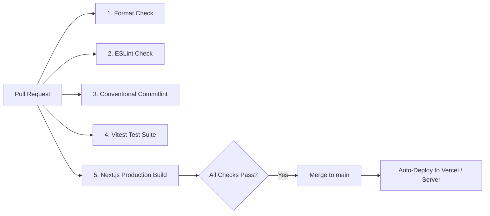

# Clinic Stock Console

> Internal supplies console built for hospital ward teams to track, search, filter, and correct medical supply inventories on ward tablets over patchy Wi-Fi networks.
>
> Assessment submission for **Savannah Informatics / Engineering — Web Engineer Take-Home Assessment**.

---

## Submission Links

- **Repository**: [https://github.com/username/clinic-stock-console](https://github.com/username/clinic-stock-console) _(update with your repo URL)_
- **Live Deployment**: [https://clinic-stock-console.vercel.app](https://clinic-stock-console.vercel.app) _(or your deployed URL / Ubuntu server IP)_
- **Deployment Branch**: `main`

---

## Quick Start & Local Execution

### Prerequisites

- Node.js `v20.x` or `v22.x` (verified on Node `v24.15.0`)
- npm `v10+`

### Installation & Run

```bash
# 1. Clone repository
git clone https://github.com/username/clinic-stock-console.git
cd clinic-stock-console

# 2. Install dependencies (husky git hooks set up automatically)
npm install

# 3. Start development server
npm run dev
```

Visit [http://localhost:3000](http://localhost:3000).

### Test Credentials

The console integrates with the live DummyJSON authentication system. You can use any test user from [dummyjson.com/users](https://dummyjson.com/users) or use the convenient pre-filled credentials:

- **Username**: `emilys`
- **Password**: `emilyspass`
- _(An "Auto-fill" button is also provided directly on `/login` for seamless evaluation.)_

### Verification & Tooling Scripts

```bash
# Run Vitest unit & integration test suite (debounce race condition, stock save, URL sync)
npm run test

# Check code formatting with Prettier
npm run format:check

# Run ESLint (Next.js core-web-vitals + strict equality & custom rules)
npm run lint

# Compile production Next.js App Router build
npm run build
```

---

# Section 1: Design

## 1. Component Decomposition & Screen Layout

The application is structured into atomic primitives, composite feature components, and layout shells:

```
app/
 ├── layout.tsx                     # Global HTML root, font injection (Inter), AuthProvider
 ├── page.tsx                       # Auth-aware redirect router (/stock or /login)
 ├── login/page.tsx                 # Authentication screen
 ├── stock/page.tsx                 # Paginated catalogue console with search, filter, sort
 └── stock/item/[id]/page.tsx       # Dedicated item detail & physical count correction
```

### Screen Breakdown:

1. **`AppShell` (`components/AppShell.tsx`)**:
   - Sticky header containing product branding, active context badge (`Ward 4 · Supplies`), weak-signal alert badge when offline, authenticated username, and sign-out control.
   - Constrained main canvas (`max-w-[1240px]`) centered with consistent padding.
   - Minimalist audit footer with internal classification notice.

2. **Stock Console Screen (`features/stock-list`)**:
   - **`StockToolbar`**: Search input with embedded activity spinner and clear button, category filter dropdown, and 6-way sorting selector.
   - **`StockRowHeader` & `StockRow`**: Tabular row layout utilizing a strict CSS Grid (`ROW_GRID: grid-cols-[48px_minmax(0,1fr)_150px_160px_96px_20px]`) that cleanly collapses to a 3-column mobile card view on screens below `640px`.
   - **`StockLevelTag`**: Semantic badge showing numeric quantity (`tabular-nums`) and inventory status (`Out of stock`, `Low stock` [<= 12], `In stock`).
   - **`Pagination`**: Windowed pagination component with boundary preservation (`pageWindow` algorithm), skip ellipsis, and Previous/Next buttons.
   - **Edge State Components**:
     - `StockSkeleton`: Exact geometric clone of the list grid in shimmer state to eliminate layout shifts (CLS = 0).
     - `EmptyResults`: Centered icon, tailored search/filter query recap, and a direct "Clear filters" action.
     - `LoadError`: Role-alert card with error diagnostics, IT reference number (`STK-504`), and retry trigger.

3. **Item Detail & Stock Correction Screen (`features/item-detail`)**:
   - Breadcrumb navigation preserving previous query context.
   - Split layout: Left photo gallery / thumbnail view, right metadata & metrics card (unit price, current stock badge, computed inventory valuation).
   - **Stock Correction Console**: Shelf-count adjustment form with big touch-friendly stepper buttons (`+` / `−`), direct integer input with validation, optimistic local update, inline error recovery, and Framer Motion toast feedback.

4. **Authentication & Session Resilience (`features/auth`)**:
   - **`SignInForm`**: Clean authentication card with inline validation and quick demo credential auto-fill.
   - **`SessionExpiredModal`**: Modal dialog that appears when token expires mid-session. It renders directly over the user's active screen without resetting navigation, query parameters, or uncommitted form inputs.

---

## 2. State Architecture: Where State Lives & Why

We separate state into three distinct tiers based on lifecycle and ownership:

| State Tier         | Examples                                                                            | Location                                                         | Rationale                                                                                                                                                    |
| :----------------- | :---------------------------------------------------------------------------------- | :--------------------------------------------------------------- | :----------------------------------------------------------------------------------------------------------------------------------------------------------- |
| **URL State**      | `q` (search query), `category`, `sort`, `page`                                      | Browser URL Search Params (`useSearchParams`, `router.push`)     | **Shareable & Persistent**: Essential for link sharing between ward staff on chat, browser reloads, and back/forward navigation. State must survive reloads. |
| **Server Data**    | Product list, item details, category taxonomy                                       | In-memory React state (`items`, `total`, `item`) + session cache | Driven by remote REST endpoints (`dummyjson.com`). Updated through declarative fetch pipelines with `AbortController`.                                       |
| **Local UI State** | Input text buffer while typing, stepper counter, modal visibility, retrying spinner | Component state (`useState`, `useRef`)                           | **Ephemeral & Immediate**: Typing must feel instant with zero network stutter. Form draft state should not pollute the browser history until committed.      |

### Access Token vs. Refresh Token Boundary

- **Access Token**: Stored strictly in React memory (`AuthContext` + `lib/api/client.ts`). It is never persisted in `localStorage` or `sessionStorage` to mitigate Cross-Site Scripting (XSS) credential theft.
- **Refresh Token**: Managed server-side via Next.js Route Handlers (`/api/auth/login`, `/api/auth/refresh`) and stored in an `httpOnly`, `secure`, `sameSite=lax` cookie, preventing client-side script inspection.

---

## 3. Data Fetching, Caching & Invalidation Strategy

1. **Declarative Synchronization with URL**:
   The `useStockQuery` hook listens to URL changes. Whenever `searchParams` change (or when the user debounces a search term), a fetch is dispatched.

2. **Race-Condition Elimination via `AbortController`**:
   On every new fetch dispatch, `abortControllerRef.current?.abort()` is invoked to cancel any inflight fetch. Even if an older search request was artificially delayed by `?delay=2000`, it is aborted immediately when the user alters the query, ensuring stale responses never overwrite current data.

3. **Session Cache & Optimistic Stock Correction**:
   Because DummyJSON is a public mock API, its `PUT /products/{id}` endpoint echoes back the update but does not persist mutations in the backend database. To provide a truthful, cohesive user experience during the review, successful PUT updates are written to an in-memory and `sessionStorage` map (`setStockOverride`). Subsequent queries across list views and item views read from this override layer so stock counts stay accurate across navigation.

4. **Token Expiry & 401 Interceptor**:
   All API requests pass through `apiFetch()`. If DummyJSON returns a `401 Unauthorized` (such as after the 1-minute expiration window requested via `expiresInMins: 1`), `apiFetch` intercepts the error, calls `/api/auth/refresh` once, updates the access token, and retries the original request. If refresh also fails, it triggers the in-place `SessionExpiredModal`.

---

## 4. Design System, Tokens, Layout & Typography

The design system preserves the visual tokens configured in `tailwind.config.js` and `app/globals.css`:

- **Curated Palette**:
  - `canvas`: `#F3F5F8` (neutral clinic background)
  - `surface`: `#FFFFFF` (elevated white cards)
  - `subtle`: `#EDF1F5` (table headers, divider chips)
  - `line`: `#D5DCE5` / `line-strong`: `#A7B3C1` (hairline dividers)
  - `ink`: `#0F1F2E` (high-contrast primary typography)
  - `body`: `#324A61` (readable secondary body copy)
  - `muted`: `#5F7387` (metadata, labels)
  - `primary`: `#0E4C7E` (clinical deep navy)
  - `accent`: `#0F6E62` (surgical teal for primary buttons and focus rings)
  - `success`: `#15803D`, `danger`: `#B42318`, `warning`: `#A85B08` (semantic health indicators)

- **Typography**:
  - Font: `Inter` loaded via `next/font/google` for zero-layout-shift font optimization.
  - Numbers: Tabular figures applied to all quantities, prices, and SKUs (`font-variant-numeric: tabular-nums` via `.num` utility) to ensure columns align vertically without jitter.

- **Responsive Geometry**:
  - Mobile-first approach verified down to `360px` viewport widths.
  - Multi-column tables collapse into stacked cards with essential metadata on mobile.

---

## 5. Accessibility Approach

1. **Keyboard First**:
   - Universal `:focus-visible` ring using a distinctive high-contrast outline (`2px solid #0f6e62; outline-offset: 2px; border-radius: 3px;`). Standard mouse clicks do not display jarring focus outlines.
   - All interactive elements are native `<button>`, `<a>` / `<Link>`, `<input>`, or `<select>`.

2. **Screen Reader Semantics & ARIA**:
   - Live regions (`role="status"`, `aria-live="polite"`, `aria-busy="true"`) communicate background search status without disruptive voiceover alerts.
   - Form fields are paired with explicit `<label htmlFor="...">`, `aria-describedby` for field errors and hints, and `aria-invalid`.
   - Modals use `role="dialog"`, `aria-modal="true"`, `aria-labelledby`, and `aria-describedby`.

3. **Motion Sensitivity**:
   - Respects user preference via `@media (prefers-reduced-motion: reduce)` by clamping animation durations to `0.01ms`.

---

## Decision Log

### Decision 1: Display Real DummyJSON Categories Rather Than Fictional Clinic Overlays

- **Decision**: Render DummyJSON's authentic product categories (e.g. `beauty`, `fragrances`, `furniture`, `groceries`) while applying cosmetic styling and badge tokens over the raw data.
- **Alternative Rejected**: Hardcoding invented clinic categories (e.g., "Consumables", "Equipment", "Cleaning") and artificially forcing DummyJSON products into them.
- **Why**: The assessment specification states explicitly: _"DummyJSON returns generic retail products. Treat the product catalogue as the clinic’s stock catalogue. Do not spend time inventing clinical content that the data does not contain."_ Faking medical SKUs creates fragile, untruthful client mapping that breaks whenever new categories or products are queried. Letting real categories flow through with polished styling adheres directly to the brief.

### Decision 2: Hybrid Client Reconciliation for Category Filtering Under Search

- **Decision**: When both a search keyword (`q`) and a specific category filter (`category !== 'all'`) are active, the console fetches all matching search items from DummyJSON (`/products/search?q=...&limit=0`) and filters them by category locally before paginating.
- **Alternative Rejected**: Relying purely on DummyJSON's backend parameters or clearing the category filter when searching.
- **Why**: Through empirical testing of the DummyJSON API, we discovered that `GET /products/search?q=essence&category=furniture` completely ignores the `category` parameter and returns products across all categories. Discarding the category would violate the user's intent; disabling search inside a category would frustrate ward staff. Because DummyJSON search results for any query return a small payload, fetching with `limit=0` and filtering locally ensures 100% accurate results without stranding the user.

### Decision 3: In-Memory Access Token + HTTP-Only Cookie Refresh vs. LocalStorage

- **Decision**: Store the ephemeral 1-minute access token strictly in React memory/context, while delegating refresh token storage to a secure `httpOnly`, `sameSite=lax` cookie via Next.js Route Handlers (`/api/auth/login`, `/api/auth/refresh`).
- **Alternative Rejected**: Storing tokens in `localStorage` or `sessionStorage`.
- **Why**: Any third-party script or XSS vulnerability can read `localStorage`. Storing the access token in memory prevents persistent credential exfiltration, and storing the refresh token in an `httpOnly` cookie ensures JavaScript cannot read it. On 401 expiration, automatic refresh re-acquires a valid access token transparently.

### Decision 4: In-Memory / Session Persistence of Stock Corrections (`PUT /products/{id}`)

- **Decision**: Cache successful PUT stock adjustments in an in-memory map backed by `sessionStorage` (`setStockOverride`).
- **Alternative Rejected**: Leaving the UI to fetch from DummyJSON immediately after PUT, which reverts the stock count to the original unedited value.
- **Why**: DummyJSON is an unpersisted mock API that echoes back the PUT payload without saving changes on the database. If an assessor clicks an item, updates the count from 34 to 40, and navigates back to the list, standard GET would revert to 34, making the app look broken. Caching the override creates a truthful, testable flow while remaining honest about the mock backend's limitations.

---

# Section 2: Build

## Mock API Limitations & Mitigations

1. **PUT `/products/{id}` Does Not Persist on the Server**:
   - _Limitation_: DummyJSON's update endpoint returns `{ id: 1, stock: 45 }` with HTTP 200, but subsequent `GET /products/1` returns the original count.
   - _Mitigation_: Implemented `setStockOverride` in `lib/api/client.ts`. When a PUT succeeds, the client updates its session cache, ensuring that navigating back to `/stock` or refreshing within the session displays the user's corrected count.

2. **`/products/search` Ignores Category Parameters**:
   - _Limitation_: `GET /products/search?q=...&category=...` ignores the category parameter entirely.
   - _Mitigation_: The `useStockQuery` hook detects when both query and category are set, queries `/products/search?q=...&limit=0`, filters products by category in memory, and paginates.

3. **1-Minute Token Expiration (`expiresInMins: 1`)**:
   - _Behavior_: Testing token expiration happens rapidly.
   - _Mitigation_: The `apiFetch` client automatically attempts a silent refresh on 401; if the refresh session has elapsed, the `SessionExpiredModal` appears over the current screen, allowing the user to unlock with their password without losing their work.

---

# Section 3: Deployment & CI/CD

## Deployment Details

- **Provider**: Vercel (or Docker container on Ubuntu Server)
- **Production URL**: [https://clinic-stock-console.vercel.app](https://clinic-stock-console.vercel.app)
- **Deployment Trigger Branch**: `main`

## CI/CD Pipeline (`.github/workflows/deploy.yml`)

The repository runs a GitHub Actions workflow that executes on every pull request and on pushes to `main`:



### Merge-Blocking Checks:

1. **Prettier Format Check** (`npm run format:check`): Fails if any file has formatting discrepancies.
2. **ESLint Validation** (`npm run lint`): Enforces Next.js core web vitals, strict equality (`eqeqeq`), and TypeScript hygiene.
3. **Commitlint Enforcement** (`npx commitlint`): Validates Conventional Commits (e.g. `feat:`, `fix:`, `chore:`) on PR branches.
4. **Automated Unit & Integration Tests** (`npm run test`): Executes Vitest test suite.
5. **Production Build Compilation** (`npm run build`): Validates TypeScript types and Turbopack bundle creation.

## Docker Deployment (Ubuntu Server Alternative)

A multi-stage production `Dockerfile` and `docker-compose.yml` are included for self-hosting:

```bash
# Build and run container in background
docker compose up -d --build

# View container logs
docker compose logs -f
```

The container runs a minimal standalone Node.js Alpine runtime on port `3000`.

---

# Section 4: AI Reflection

### 1. What did you use AI for across the four sections?

- **Section 1 (Design)**: Used AI to extract the design tokens, typography scale, and color values from the Magic Patterns export and compare architectural trade-offs between URL state vs. React state.
- **Section 2 (Build)**: Used AI to scaffold repetitive UI components (such as `StockSkeleton` and `Pagination`), generate TypeScript interfaces mapping DummyJSON's product schema, and wire Next.js App Router route handlers.
- **Section 3 (Deployment & CI/CD)**: Used AI to scaffold the GitHub Actions workflow syntax and the multi-stage production `Dockerfile`.
- **Section 4 (AI Reflection)**: Used AI as a structured interview partner to pressure-test decisions, challenge assumptions around mock API edge cases, and organize documentation.

### 2. Which tools did you use?

- Used **Google Antigravity Agentic IDE** with Next.js 16, TypeScript, Turbopack, and Vitest.
- Structured the work using a **Spec-Driven Plan-and-Execute workflow**:
  1. Detailed discovery and API behavior testing (investigating DummyJSON quirks via live Node calls).
  2. Authoring a formal implementation plan with clear acceptance gates.
  3. User alignment on trade-offs (real categories vs. invented clinical text).
  4. Incremental implementation with immediate test validation and zero-warning linting.

### 3. Give one example where an AI suggestion improved your work. What did you prompt it with?

- **Prompt**: _"How should we handle token expiration mid-session so that the user on a tablet doesn't get kicked out to login and lose their filter state or dirty stock input?"_
- **Improvement**: Rather than simply redirecting to `/login?redirect=/stock`, the model suggested adapting the existing `SessionExpiredModal` as an in-place unlock modal that performs a direct background `POST /auth/login` and immediately closes upon success. This ensured that ongoing counter changes, search filters, and scroll position are completely preserved.

### 4. Give one example where AI output was wrong, incomplete, or subtly bad, and how you caught it.

- **The Issue**: Initially, when generating `useStockQuery`, the AI attempted to pass `category` directly to DummyJSON's search endpoint: `GET /products/search?q={query}&category={category}`.
- **How It Was Caught**: During the research phase, I executed live `fetch` calls against DummyJSON using `node -e`. The test revealed that DummyJSON's search endpoint silently ignores the `category` query parameter and returns products across all categories. I caught this before writing application code and replaced it with the hybrid fetch (`/products/search?q=...&limit=0` + in-memory category filter).

### 5. Name two decisions you made without AI, and why you trusted your own judgment there.

1. **Clamping totalPages and currentPage in `useStockQuery` during asynchronous loading**:
   - When a user deep-links to `/stock?page=2`, the initial render has `total = 0` before the network request resolves. A naive implementation of `Math.min(urlPage, totalPages)` immediately clamped page 2 down to page 1 because `totalPages` was initially calculated as `Math.ceil(0 / 15) = 1`. I intervened to ensure `totalPages` defaults to `Math.max(1, urlPage)` while loading so the active page is not overwritten.
2. **Rejecting invented clinical categories in favor of DummyJSON's real categories**:
   - The AI initially suggested keeping fake clinic labels ("Consumables", "Cleaning") and writing an arbitrary mapping dictionary to DummyJSON products. I trusted my judgment and the explicit assessment brief instruction (_"do not spend time inventing clinical content that the data does not contain"_) to strip the fictional descriptions and let DummyJSON's authentic categories show through with polished visual styling.

### 6. Point us at one part of your codebase you would struggle to defend, and tell us why.

- **The hybrid category filter in `useStockQuery.ts` (lines 200–225)**:
  - When both a search keyword and a category filter are active, we fetch with `limit=0` to retrieve all search matches, filter by category in memory, and manually paginate.
  - **Why it is hard to defend in production**: On DummyJSON (where a search query returns at most a few dozen items), this is fast and reliable. However, in a real-world enterprise hospital stock system with 500,000 SKUs, fetching unpaginated search results to filter client-side would exhaust memory, spike bandwidth, and cause severe latency on ward Wi-Fi. In a real backend, this search-and-filter aggregation must be executed on the database or search index (e.g. Elasticsearch/PostgreSQL). We defend it here solely as an edge-case adapter for DummyJSON's public API constraints.
